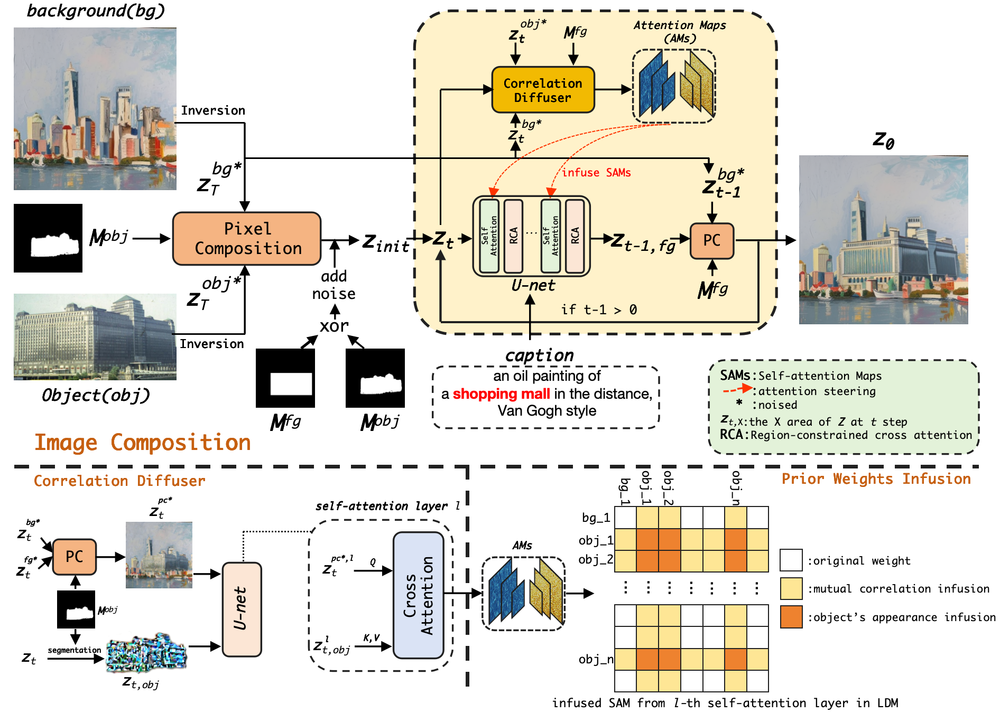

<div align="center">
<h1>PrimeComposer: Faster Progressively Combined Diffusion for Image Composition with Attention Steering</h1>


[Yibin Wang](https://codegoat24.github.io)\*, [Weizhong Zhang](https://weizhonz.github.io/)\*, [Jianwei Zheng](https://zhengjianwei2.github.io/), [Cheng Jin](https://cjinfdu.github.io/)&#8224; 

(*equal contribution, &#8224;corresponding author)

[Fudan University]

ACM MM2024

<a href="https://arxiv.org/abs/2403.05053">
</a>

</div>

## 📖 Abstract
Image composition involves seamlessly integrating given objects into a specific visual context. The current training-free methods rely on composing attention weights from several samplers to guide the generator. However, since these weights are derived from disparate contexts, their combination leads to coherence confusion in synthesis and loss of appearance information. These issues worsen with their excessive focus on background generation, even when unnecessary in this task. This not only slows down inference but also compromises foreground generation quality. Moreover, these methods introduce unwanted artifacts in the transition area. In this paper, we formulate image composition as a subject-based local editing task, solely focusing on foreground generation. At each step, the edited foreground is combined with the noisy background to maintain scene consistency. To address the remaining issues, we propose PrimeComposer, a faster training-free diffuser that composites the images by well-designed attention steering across different noise levels. This steering is predominantly achieved by our Correlation Diffuser, utilizing its self-attention layers at each step. Within these layers, the synthesized subject interacts with both the referenced object and background, capturing intricate details and coherent relationships. This prior information is encoded into the  attention weights, which are then integrated into the self-attention layers of the generator to guide the synthesis process. Besides, we introduce a Region-constrained Cross-Attention to confine the impact of specific subject-related words to desired regions, addressing the unwanted artifacts shown in the prior method thereby further improving the coherence in the transition area. Our method exhibits the fastest inference efficiency and extensive experiments demonstrate our superiority both qualitatively and quantitatively.


---

</div>




</div>

<br>

## 🔧 Setup

Our codebase is built on [Stable-Diffusion](https://github.com/Stability-AI/stablediffusion)
and has shared dependencies and model architecture. An NVIDIA A100 40GB PCIe is recommended, though this may vary depending on the input samples (minimum 24 GB).

### Creating a Conda Environment

```
conda env create -f primecomposer.yaml
conda activate primecomposer
```

### Downloading Stable-Diffusion Weights

Download the StableDiffusion weights from the [Stability AI at Hugging Face](https://huggingface.co/stabilityai/stable-diffusion-2-1-base/blob/main/v2-1_512-ema-pruned.ckpt)
(download the `sd-v2-1_512-ema-pruned.ckpt` file), and put it under `./ckpt` folder.

## 🚀 Running PrimeComposer

### Data Preparation
Our dataset are available in [PrimeComposer Benchmark](https://pan.baidu.com/s/1j1j3DbY9dz9Oouau6dfU-g?pwd=dym1)[code: dym1]. Please put input samples under `./inputs` directory. Each sample involves one background (bg), one foreground (fg), one segmentation mask for the foreground (fg_mask), and one user mask that denotes the desired composition location (mask_bg_fg). The input data structure is like this:
```
inputs
├── Real-Painting-mask
│  ├── prompt1
│  │  ├── bgxx.png
│  │  ├── fgxx.png
│  │  ├── fgxx_mask.png
│  │  ├── mask_bg_fg.png
│  ├── prompt2
│  ├── ...
├── Real-Real-mask
│  ├── prompt1
│  │  ├── bgxx.png
│  │  ├── fgxx.png
│  │  ├── fgxx_mask.png
│  │  ├── mask_bg_fg.png
│  ├── prompt2
│  ├── ...
```

You also can customize input samples. Note that the resolution of the input foreground should not be too small. 

- Cross domain: the background and foreground images originate from different visual domains.
- Same domain: both the background and foreground images belong to the same photorealism domain.

### Image Composition
To execute the PrimeComposer under the 'same_domain' mode, run the following commands:

```
python scripts/main_tf_icon.py  --ckpt ./ckpt/v2-1_512-ema-pruned.ckpt      \
                                --root ./inputs/Real-Real-mask       \
                                --domain 'same'                   \
                                --dpm_steps 20                    \
                                --dpm_order 2                     \
                                --scale 2                       \
                                --tau_a 0.3                       \
                                --tau_c 0.1                       \
                                --outdir ./outputs              \
                                --gpu cuda:0                      \
                                --seed 3407 \
                                --attn_mask True 
```

- `ckpt`: The path to the checkpoint of Stable Diffusion.
- `root`: The path to your input data.
- `domain`: Setting 'cross' if the foreground and background are from different visual domains, otherwise 'same'. 
- `dpm_steps`: The diffusion sampling steps.
- `dpm_solver`: The order of the probability flow ODE solver.
- `scale`: The classifier-free guidance (CFG) scale.
- `tau_a`: The threshold for prior weights infusion.

For the 'cross_domain' mode, we prepare some 'cartoon_run.sh', 'sketch_run.sh', and 'painting_run.sh'. Run the following commands for example:
```
sh cartoon_run.sh                    
```


## 💻 Test Benchmark

The complete PrimeComposer test benchmark is available at [here](https://pan.baidu.com/s/1j1j3DbY9dz9Oouau6dfU-g?pwd=dym1)[code: dym1]. It is preprocessed from [this OneDrive folder](https://entuedu-my.sharepoint.com/:f:/g/personal/shilin002_e_ntu_edu_sg/EmmCgLm_3OZCssqjaGdvjMwBCIvqfjsyphjqNs7g2DFzQQ?e=JSwOHY). 


## 🌄 Visual Results


---

</div>


---

</div>


---

</div>


## 🙏 Acknowledgments
Our work is standing on the shoulders of giants. We thank the following contributors that our code is based on: [Stable-Diffusion](https://github.com/Stability-AI/stablediffusion), [Prompt-to-Prompt](https://github.com/google/prompt-to-prompt) and [TF-ICON](https://github.com/Shilin-LU/TF-ICON). 

## 🖊️ Citation
If you find PrimeComposer useful or relevant to your research, please kindly cite our paper:

```bibtex
@inproceedings{primecomposer,
  title={PrimeComposer: Faster Progressively Combined Diffusion for Image Composition with Attention Steering},
  author={Wang, Yibin and Zhang, Weizhong and Zheng, Jianwei and Jin, Cheng},
  booktitle={ACM MM},
  year={2024}
}
```

## 📧 Contact

If you have any technical comments or questions, please open a new issue or feel free to contact [Yibin Wang](https://codegoat24.github.io).
